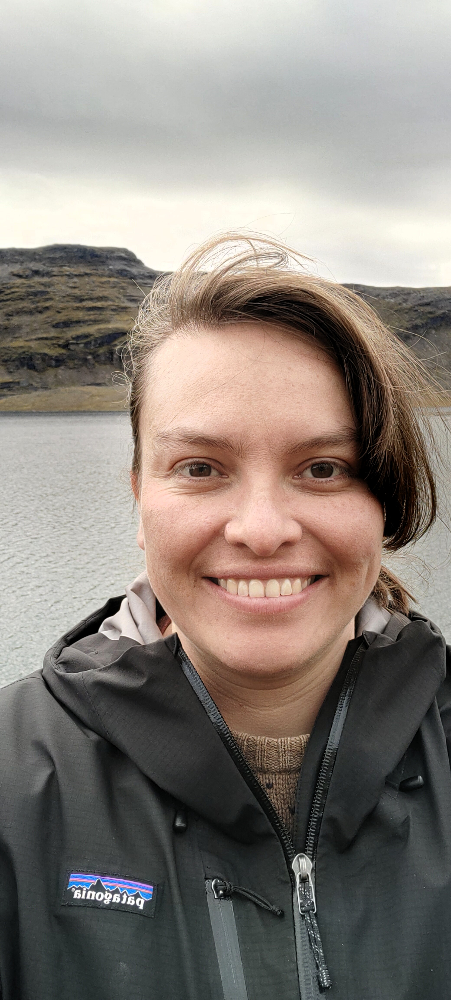
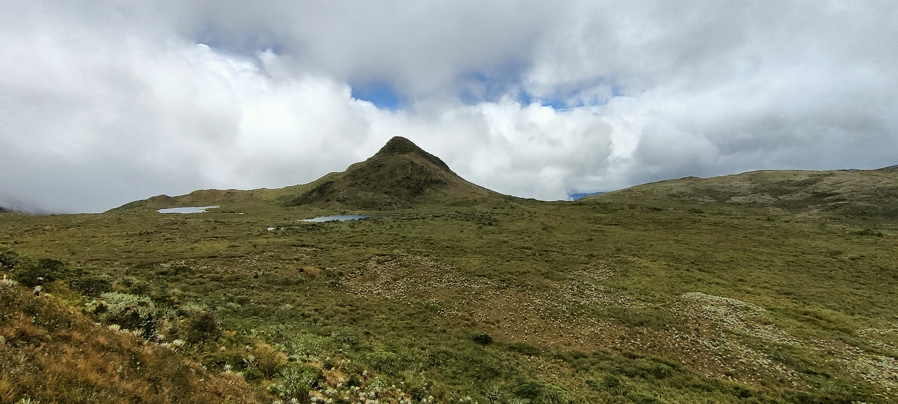
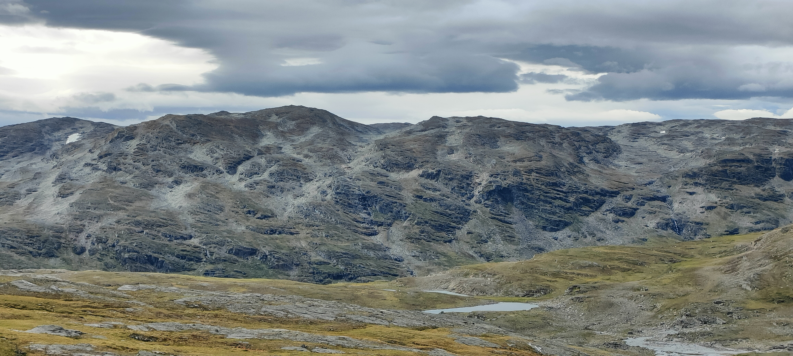
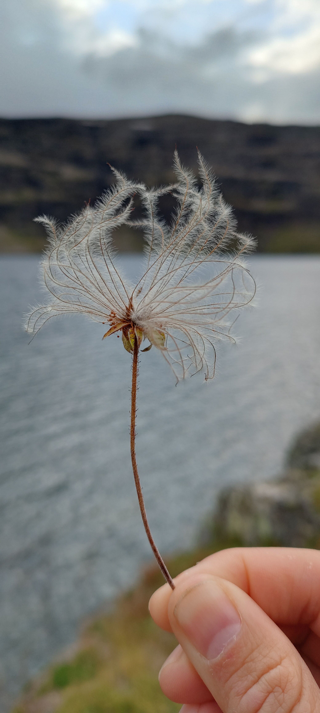
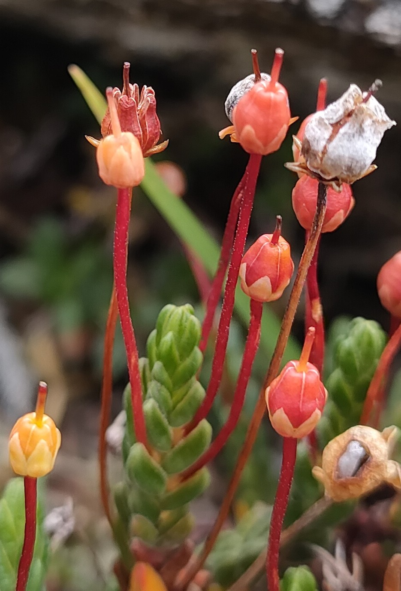

::: {.field-portrait}
{fig-alt="Camila doing fieldwork by a mountain lake"}

[At Latnjajaure Field Station, northern Sweden]{.field-cap}
:::

I am a **global change ecologist** and **biogeographer**, currently working in the [EDGE LAB](https://edge-ecology.com/) at [Department of Biological & Environmental Sciences](https://www.gu.se/en/biological-environmental-sciences) at [University of Gothenburg](https://www.gu.se/en), and affiliated with the [Gothenburg Global Biodiversity Centre (GGBC)](https://www.gu.se/en/ggbc-global-biodiversity).

My research focuses on understanding what drives the complex patterns of biodiversity change over time in mountain regions around the world.

I grew up in Colombia, surrounded by stunning landscapes and diverse ecosystems, which sparked my passion for ecology. At the same time, I witnessed the very real threats of climate change and human activities to biodiversity, experiences that shaped my drive to understand the patterns and processes behind these changes.

As a computational ecologist, I use analytical tools and Bayesian modeling to create novel frameworks that help answer key ecological questions. My work focuses on analyzing big data and uncovering the global processes that influence biodiversity's distribution across space and time. While much of my research has centered on the Neotropics, I’ve also explored Forest, Alpine, Tundra, and Mediterranean ecosystems.

In addition to my research, I’m deeply passionate about data visualization and making science accessible to a wider audience, especially when it comes to wildlife conservation.

My research activity is structured around five main lines:

-   Biogeography
-   Spatial modeling (GIS)
-   Species range shifts
-   Landscape ecology
-   Biodiversity conservation

<figure class="science-quote" aria-label="Quote from Arthur Tansley">
  <blockquote>
    Every genuine worker in science is an explorer, who is continually meeting fresh things and fresh situations, to which they have to adapt their material and mental equipment.
  </blockquote>
  <figcaption>Arthur Tansley, 1923:97. Adapted for inclusive language.</figcaption>
</figure>

## Education

My educational background is in ecology with an emphasis on community ecology and spatial modeling.

 ***Ph.D.*** in Global change biology 2023

[University of Bergen](https://www.uib.no/en/bio)

 ***M.Sc.*** in Ecology and Evolution 2019

[University of Amsterdam](https://www.uva.nl/en)

 ***B.Sc.*** in Ecology 2014

[Pontifical Xavierian University](https://www.javeriana.edu.co/inicio)

## My Interests

-   Biogeography
-   Quantitative ecology
-   Bayesian inference
-   Modeling and simulation
-   R language
-   Data visualization
-   Learning new skills
-   Digital illustration

## From the field

Fieldwork is where science and photography meet for me. My questions have carried me from the páramos of the Colombian Andes to the Fjällen of northern Sweden.

```{=html}
<div class="field-slideshow" data-autoplay="6000">
  <div class="fs-track">
    <figure class="fs-slide" style="background-image:url('media/IMG20250705130821.jpg')">
      
      <figcaption>Páramo de Chingaza, Cundinamarca, Colombia — where my love for mountains began.</figcaption>
    </figure>
    <figure class="fs-slide" style="background-image:url('media/IMG20240817104632.jpg')">
      
      <figcaption>Latnjajaure Field Station, northern Sweden.</figcaption>
    </figure>
    <figure class="fs-slide" style="background-image:url('media/IMG20240817184653.jpg')">
      
      <figcaption>Mountain avens (<em>Dryas</em>), Latnjajaure, Sweden.</figcaption>
    </figure>
    <figure class="fs-slide" style="background-image:url('media/IMG20240817153348.jpg')">
      
      <figcaption>Alpine heather in fruit, Latnjajaure, Sweden.</figcaption>
    </figure>
  </div>
  <button class="fs-arrow fs-prev" aria-label="Previous photo">&#8249;</button>
  <button class="fs-arrow fs-next" aria-label="Next photo">&#8250;</button>
  <span class="fs-credit">&copy; Camila Pacheco-Riaño</span>
  <div class="fs-dots" aria-hidden="true"></div>
</div>
<script>
(function () {
  document.querySelectorAll('.field-slideshow').forEach(function (ss) {
    var track = ss.querySelector('.fs-track');
    var slides = Array.prototype.slice.call(ss.querySelectorAll('.fs-slide'));
    var dotsWrap = ss.querySelector('.fs-dots');
    var i = 0, timer = null;
    var delay = parseInt(ss.getAttribute('data-autoplay'), 10) || 0;
    slides.forEach(function (_, n) {
      var d = document.createElement('button');
      d.className = 'fs-dot';
      d.addEventListener('click', function () { go(n); reset(); });
      dotsWrap.appendChild(d);
    });
    var dots = Array.prototype.slice.call(dotsWrap.children);
    function go(n) {
      i = (n + slides.length) % slides.length;
      track.style.transform = 'translateX(' + (-i * 100) + '%)';
      dots.forEach(function (d, k) { d.classList.toggle('active', k === i); });
    }
    function next() { go(i + 1); }
    function prev() { go(i - 1); }
    function reset() { if (delay) { clearInterval(timer); timer = setInterval(next, delay); } }
    ss.querySelector('.fs-next').addEventListener('click', function () { next(); reset(); });
    ss.querySelector('.fs-prev').addEventListener('click', function () { prev(); reset(); });
    ss.addEventListener('mouseenter', function () { clearInterval(timer); });
    ss.addEventListener('mouseleave', reset);
    go(0);
    reset();
  });
})();
</script>
```
